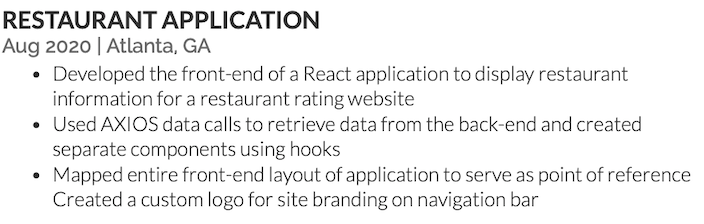
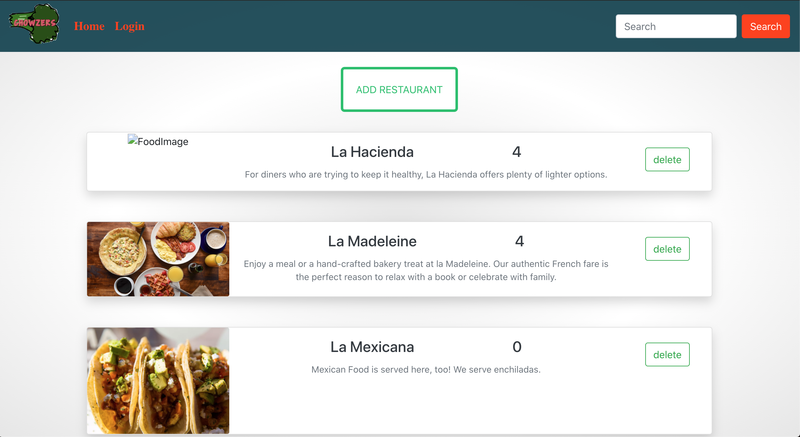
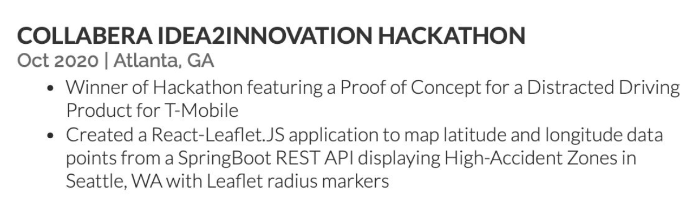

        <h2>Restaurant API Rating Website</h2>
        <h4> React / SpringBoot Rest API</h4>

<!-- [Link](url) and  -->

<b><a href="https://www.youtube.com/watch?v=dwS9b3YqnFs">Video Demo!</a>
</b> | 
<a href="https://github.com/JumpTeamProject/react-frontend/tree/Caroline_Branch">Front-End GitHub Repo</a> | 
<a href="https://github.com/JumpTeamProject">Full-Stack GitHub Repo</a> | 
<a href="https://drive.google.com/file/d/1aq3CEqe1-K2tVDR-njkPdlym_qqCQ_qG/view">Page Layout Plan</a> | 
<a href="https://www.youtube.com/watch?v=gzf0hy-3cIM">Jira Demo</a>

 
 

        <h2>Team NextGen6G Hackathon Project</h2>
        <h4> React-Leaflet / SpringBoot Rest API</h4>

