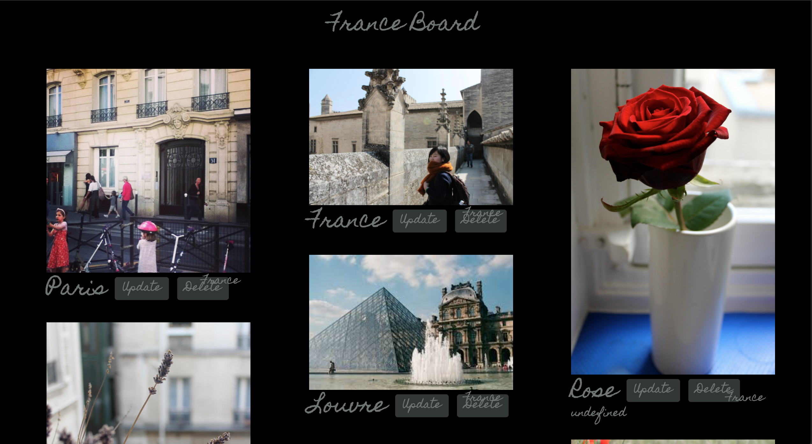
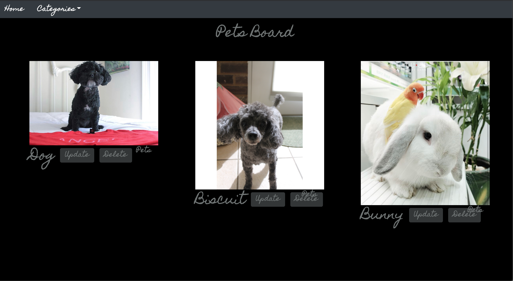

        <h2>Restaurant API Rating Website</h2>
        <h4> React / SpringBoot Rest API / MongoDB</h4>

<!-- [Link](url) and  -->

<!-- <b><a href="https://www.youtube.com/watch?v=cEly0IXPKYI">Video Demo!</a>
</b> | -->
<a href="https://github.com/JumpTeamProject/react-frontend/tree/Caroline_Branch">Front-End GitHub Repo</a> | 
<a href="https://github.com/JumpTeamProject">Full-Stack GitHub Repo</a> | 
<a href="https://drive.google.com/file/d/1aq3CEqe1-K2tVDR-njkPdlym_qqCQ_qG/view">Page Layout Plan</a> | 
<a href="https://www.youtube.com/watch?v=gzf0hy-3cIM">Jira Demo</a>

  

<!--  -->

<iframe width="560" height="315" src="https://www.youtube.com/embed/cEly0IXPKYI" frameborder="0" allow="accelerometer; autoplay; clipboard-write; encrypted-media; gyroscope; picture-in-picture" allowfullscreen></iframe>

 

 
 

        <h2>Team NextGen6G Hackathon Project</h2>
        <h4> React-Leaflet / SpringBoot Rest API</h4>

<!-- <b><a href="https://www.youtube.com/watch?v=o0do7hn5hFg&feature=emb_title">Video Demo!</a>
</b> |  -->
<a href="https://drive.google.com/file/d/1tEumeoOhdzuL2SDn7zjzvkXgeVlISnvz/view?usp=sharing">Presentation PDF</a> | 
<a href="https://github.com/crives/NextGen6G_React_Leaflet_Map">React-Leaflet GitHub</a> | 
<a href="https://github.com/crives/NextGen6G_React_Leaflet_Map">Backend GitHub</a>
<iframe width="560" height="315" src="https://www.youtube.com/embed/o0do7hn5hFg" frameborder="0" allow="accelerometer; autoplay; clipboard-write; encrypted-media; gyroscope; picture-in-picture" allowfullscreen></iframe>

 
We created a proof of concept minimum viable product to pitch to external T-Mobile client, involving a hardware RaspberryPi with OpenCV facial recognition software for distracted drivers, as well as a React-Native text-to-speech app integrating the location data of the driver to alert when the driver is looking away or reaching a High Accident Zone (HAZ). 
React-Leaflet Map shows not only the driver in their location but the respective high-accident zones clustered from  3.5 million US Accidents Kaggle dataset.

 
Teammate contributions: 
 
<a href="https://www.youtube.com/watch?v=LXcVDIHMXvU">OpenCV Facial Recognition Video Demo</a> | 
<a href="https://www.youtube.com/watch?v=f2fLG78O4m0">NextGen6G Co-pilot B9 React Native Video Demo</a>

 

        <h2>PixBox API Website</h2>
        <h4> Vanilla JavaScript / SpringBoot Rest API / MySQL : <b><a href="https://github.com/crives/PinterestApi">GitHub Repo</a></b></h4>

<iframe width="560" height="315" src="https://www.youtube.com/embed/gK9-t0Itz8Q" frameborder="0" allow="accelerometer; autoplay; clipboard-write; encrypted-media; gyroscope; picture-in-picture" allowfullscreen></iframe>

 

* My first full-stack webpage, I created my own version of a Pinterest site for posting, updating and deleting photos. I used Vanilla JavaScript to make controller functions enabling AJAX data calls to the backend SpringBoot Rest API. 
 
* I used a name generator to create the name "PixBox" and added a custom overlay to the homepage background image using a photo editor.
 
* All photos except a few animal ones and the Louvre are from my personal photo collection taken with my DSLR camera during my time abroad in France 2012–2013.
 

 

